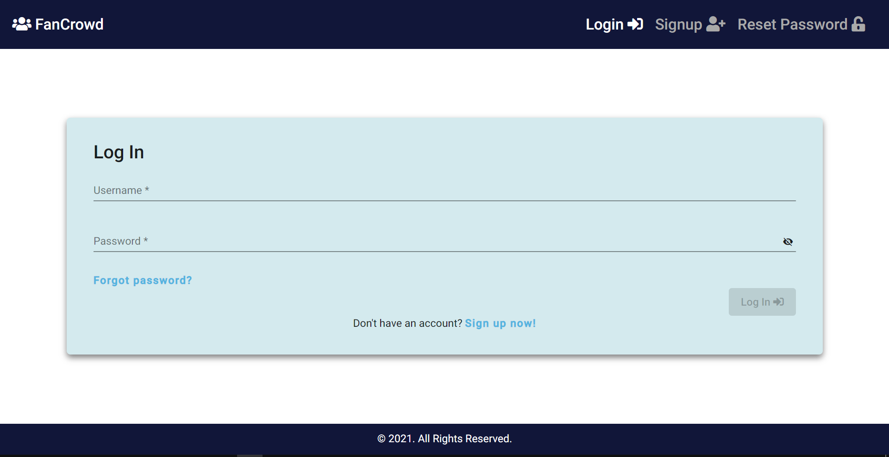
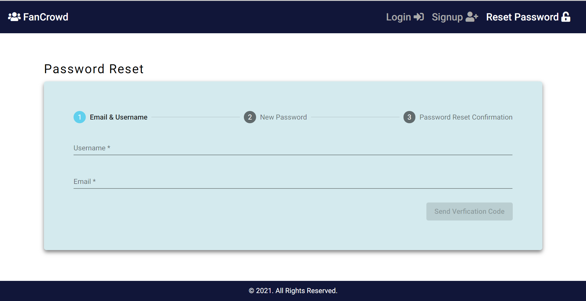
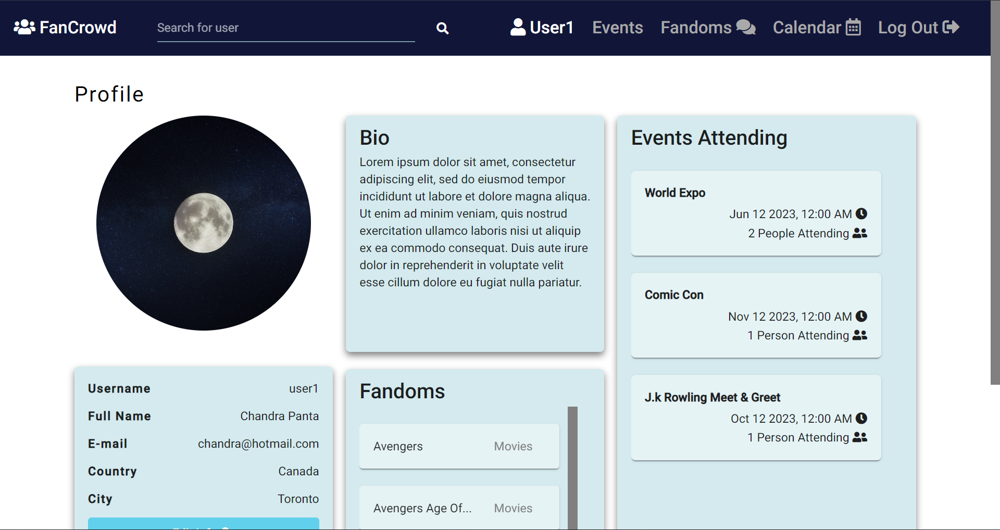
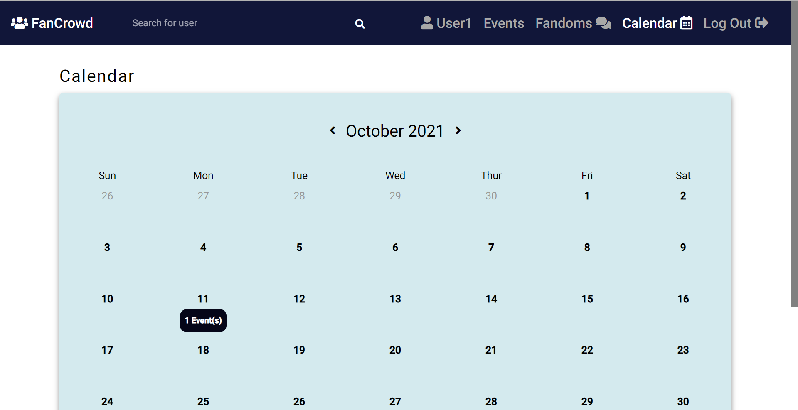
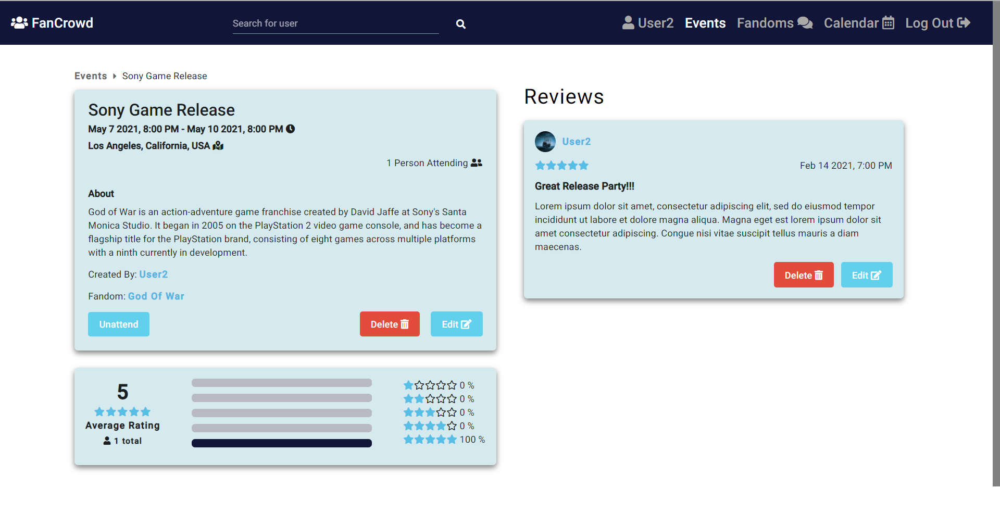
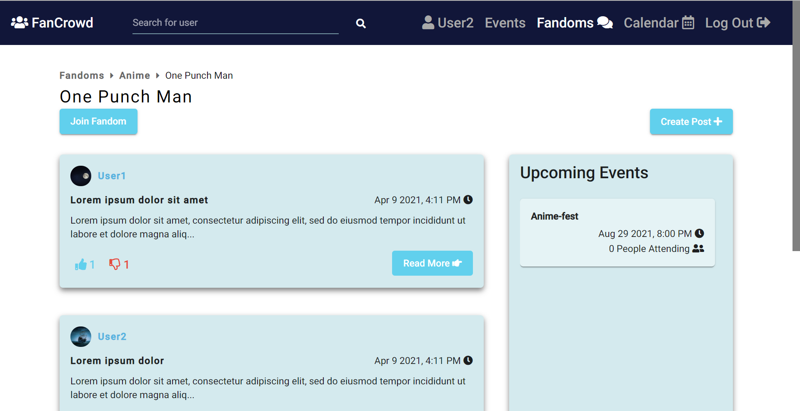

# FanCrowd

A site where users can attend events created by others users, give reviews for those events, and come together to discuss topics such as movies, technology, books and much more.

- [FanCrowd](#fancrowd)
  - [What app looks like](#what-app-looks-like)
  - [Features](#features)
  - [Dependencies](#dependencies)
  - [Running locally](#running-locally)
    - [Backend](#backend)
    - [Frontend](#frontend)

## What app looks like

 
 
 

## Features

- Sign up & login by creating a regular account (email & password)
- Auto login
- Reset Password
- Profile
  - Users can update their details
  - Users can delete their account
  - Admins can ban other users
- Events
  - Users can create events that others can attend
  - Users can see event details such as location, when event starts and ends, how are attending, and which fandom the event is for
  - Users can create, delete, update their event reviews and/or the details for the events they have created
- Fandoms
  - Users can create new fandoms within a fandom category (e.g. movies, books, tv shows...etc)
  - Admins can create new fandom categories
  - Users can join fandoms
  - Users can create posts within a fandom, like other people's posts & comments, view comments for a post
  - Users can create, delete, update their posts, comments, and fandoms they've created
  - Users can view upcoming events for a fandom
- Calendar
  - Users can view all the events they are planning to attend in a calendar
- Search
  - Users can view the profiles of other users (i.e. events user is planning to attend, fandoms user has joined, and user details)

## Dependencies

- [Nodejs](https://nodejs.org/en/download/)
  - NPM should be installed after installing Node
- [Docker Desktop](https://www.docker.com/products/docker-desktop)
  - Will be required to run dev branch
- [MongoDB](https://www.mongodb.com/try/download/community)
  - Required if you don't want to use Docker
- [MongoDB Compass](https://www.mongodb.com/try/download/compass)
  - GUI for MongoDB

Main NPM dependencies:

- express
- mongoose
- angular material
- passport js

## Running locally

**Note: Run the following steps in the dev branch as it has the Docker Config files**

1. Rename `.env-example` to `.env`.

To get env variable values:

2.  A Google account is required to send password reset emails:
    - SENDER_EMAIL
3.  Use [this article](https://dev.to/chandrapantachhetri/sending-emails-securely-using-node-js-nodemailer-smtp-gmail-and-oauth2-g3a) to get the following:
    - GOOGLE_CLIENT_ID
    - GOOGLE_CLIENT_SECRET
    - GOOGLE_REFRESH_TOKEN

### Backend

1. Open Docker Desktop, and open a new terminal in the root directory
2. Run `docker-compose build` in the terminal
3. Run `docker-compose up` to start up the container
4. To verify successful setup

   1. Open MongoDB Compass & connect to localhost:27018 to see if a `fan_crowd` database can be seen
   2. Make a GET request to `https://fan-crowd.herokuapp.com/api/auth/currentUser` on Postman and ensure an `unauthorized` message is returned

### Frontend

1. Open a new terminal in the `client` directory
2. Run `npm i`
3. Run `npm start`
4. Navigate to `http://localhost:4200`
